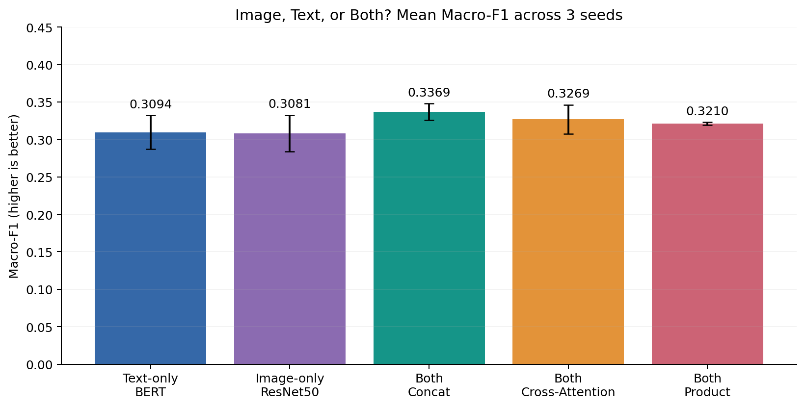
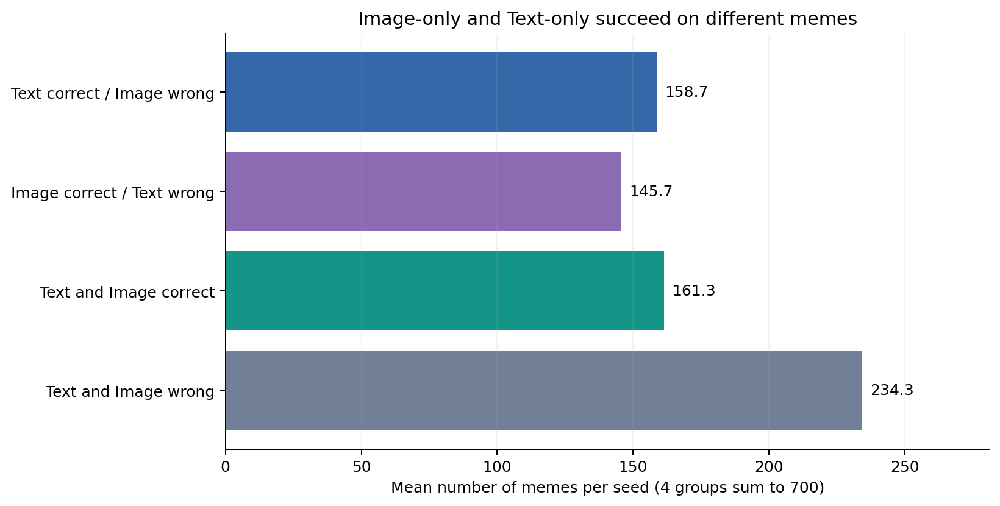
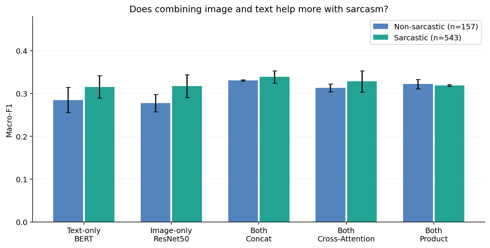

# Multimodal Meme Understanding: Image, Text, or Both?

## 1. Objective and comparison setup

We investigate how images, text, and their combination contribute to understanding a meme's message. In this experiment, sentiment classification measures one aspect of meme understanding: whether a meme is negative, neutral, or positive.

**Text-only (BERT)** receives only corrected text and is the main baseline. **Image-only (ResNet50)** receives the meme image and is the second baseline. **Both** receives the image and text, using three fusion methods: Concat, Cross-Attention, and Product. All models are evaluated on the same test memes.

**Macro-F1 is the primary metric:** it gives each sentiment class equal weight; higher is better. Accuracy is the percentage of correct predictions. `±` indicates the standard deviation across three seeds. We prioritize Macro-F1 because Positive accounts for 61.14% of the test set; favoring this majority class can produce a high Accuracy.

## 2. Which performs better: Image, Text, or Both?

| Model / input | Macro-F1 mean ± SD | Accuracy |
| --- | --- | --- |
| Text-only · BERT | 0.3094 ± 0.0225 | 45.71% |
| Image-only · ResNet50 | 0.3081 ± 0.0243 | 43.86% |
| Both · Concat | 0.3369 ± 0.0111 | 42.67% |
| Both · Cross-Attention | 0.3269 ± 0.0193 | 46.76% |
| Both · Product | 0.3210 ± 0.0019 | 40.86% |

Image-only and Text-only have similar Macro-F1 scores (0.3081 and 0.3094). **Both · Concat achieves the highest mean Macro-F1**. Concat improves by **+0.0275** over BERT, but Accuracy drops from **45.71%** to **42.67%**. Combining both modalities therefore does not improve every metric.

## 3. Do images and text complement each other?

Similar average scores do not mean the two models succeed on the same memes. We compare their predictions for each test example:

On average per seed, **Text-only is correct on 158.7 memes where Image-only is wrong**, while **Image-only is correct on 145.7 memes where Text-only is wrong**. These complementary predictions suggest an opportunity for Both to combine the strengths of each input.

The counts are averages across seeds, not 2,100 independent memes. This comparison does not identify which visual details or words explain the differences; meme images can also contain printed text.

## 4. When does Both help, and where does it fall short?

**By sentiment class:** Concat raises Neutral F1 from **0.2404** to **0.3445**, but Positive F1 drops from **0.5682** to **0.5311**. Most of the overall Macro-F1 gain comes from better performance on Neutral; Both does not improve every sentiment class.

**By sarcasm:** text and images can convey conflicting messages, making sarcasm a useful subgroup for examining the benefits of combining both modalities.

Concat improves over BERT by **+0.0231** on sarcastic memes (543 examples), and by **+0.0456** on non-sarcastic memes (157 examples). The observed gain is smaller for sarcasm, and the confidence interval for the difference between these gains includes zero. **These results do not establish a special advantage of Both for sarcastic memes.**

## 5. Is there enough evidence to conclude that Both is better?

Not yet. The table compares each fusion method with the main baseline, BERT. A confidence interval (CI) that includes zero leaves the improvement uncertain. The Holm-adjusted p-value must be below 0.05 to meet the chosen significance threshold.

| Fusion − BERT | Macro-F1 gain | 95% CI | Holm-adjusted p |
| --- | --- | --- | --- |
| Concat | +0.0275 | [-0.0011, +0.0562] | 0.3840 |
| Cross-Attention | +0.0175 | [-0.0078, +0.0425] | 0.8288 |
| Product | +0.0116 | [-0.0168, +0.0402] | 0.9027 |

We use paired bootstrap and permutation procedures matched by meme ID, with 20,000 iterations each. All three seeds for a meme are kept together. Holm correction covers all six comparisons between the fusion methods and the two baselines; none meets the 0.05 threshold. These tests evaluate the saved trained models and do not fully capture variability from retraining.

## Conclusion

**Image and Text succeed on different examples, giving Both the potential to combine complementary signals. In this experiment, Concat achieves the highest mean Macro-F1, with the largest observed class-level improvement on Neutral. However, the gains are uneven, no special advantage for sarcasm is established, and the statistical evidence is insufficient to conclude that Both outperforms the baselines.**

No checkpoints are available for image/text masking experiments, so these results cannot yet be attributed to specific visual details or words.

**Supporting data:** [Full results and methods in JSON](analysis_summary.json), [confusion matrices](tables/confusion_matrices.csv), [20 error candidate IDs for Role F](tables/error_candidates.csv).

Reproduce: `python -m src.analysis --report-date 2026-10-07`.
